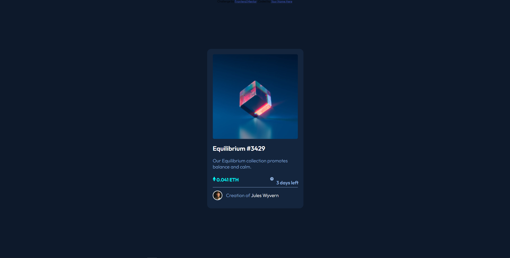

# Frontend Mentor - NFT preview card component solution

This is a solution to the [NFT preview card component challenge on Frontend Mentor](https://www.frontendmentor.io/challenges/nft-preview-card-component-SbdUL_w0U). Frontend Mentor challenges help you improve your coding skills by building realistic projects.

## Table of contents

- [Overview](#overview)
  - [The challenge](#the-challenge)
  - [Screenshot](#screenshot)
  - [Links](#links)
- [My process](#my-process)
  - [Built with](#built-with)
  - [What I learned](#what-i-learned)
  - [Continued development](#continued-development)
  - [Useful resources](#useful-resources)
- [Author](#author)
- [Acknowledgments](#acknowledgments)

## Overview

### The challenge

Users should be able to:

- View the optimal layout depending on their device's screen size
- See hover states for interactive elements

### Screenshot

### Links

- Solution URL: [Add solution URL here](https://your-solution-url.com)
- Live Site URL: [Add live site URL here](https://your-live-site-url.com)

## My process

### Built with

- HTML5
- CSS

### What I learned

i learnt how to position elements using translate. Moving forward, i will have to learn how to use css flex to make positioning easier. I had a lot of trouble with the hover effects. I spent a lot of hours on it researching the way to go about it. I still need to go through the code and digest it properly.
I hope to improve my coding as time goes on.

## Acknowledgments
I would like to thank JB Sinluenam. I had a look through her code and got an idea of how to solve the hover effect problem I was stuck on. https://www.frontendmentor.io/profile/jbsinluenam. Here is a link to their profile.
